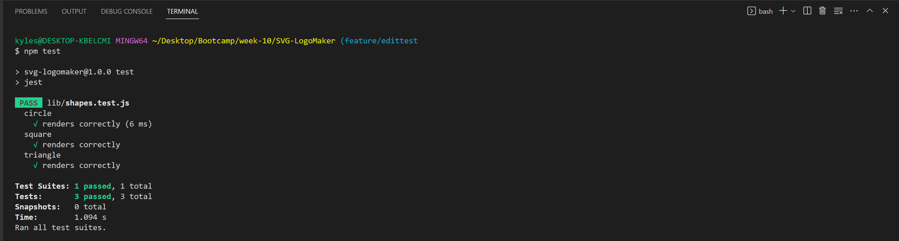

# SVG Logo Generator
  

  

## Description
This is a svg logo maker utilizing Node JS inquirer and fs to create new svg logos into a svg file.

## Table of Contents
- [Description](#Description)
- [Installation](#Installation)
- [Usage](#Usage)
- [License](#License)
- [Contributing](#Contributing)
- [Tests](#Tests)
- [Questions](#Questions)

## Installation
1. Clone repository 
2. Open terminal and enter "node index". 
3. Answer question prompts. 
4. Once complete and SVG file is written to shapes.svg file. 
5. Copy and paste file or rename shapes.svg to desired name. 

note: each time one runs through the prompts the shapes.svg file is written over.

## Usage
See steps required for process flow and below images for examples in use.

Terminal showing user inputs and Console logs with associated logo created in upper right corner:

 

Terminal showing test utilizing jest, all test passing:

See example folders for previously made logo's with this application.

Video walkthrough of jest test and inquirer prompts to file creation:

https://drive.google.com/file/d/1buUTFS8nt--ZsH46D_J9CF0urmvMGoIa/view

## License 
  

This application is covered by the MIT license.
  
## Contributing
recommendations always appreciated.

## Tests
install jest and run npm test to test rendering of shapes.

## Questions
Link to GitHub profile: https://github.com/keberlea
  
If you have questions you can reach me by email at the following address: alicia.keberle@gmail.com
  

